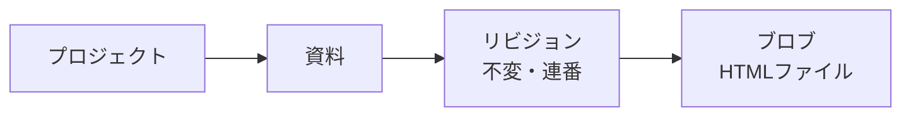
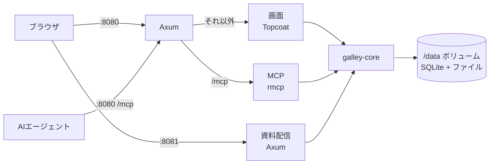
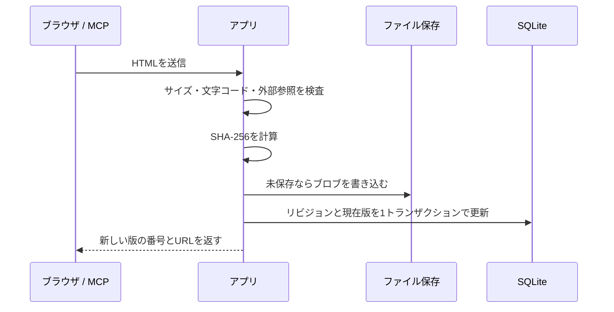

# Galley 設計書

## 概要と目的

AI が生成した HTML 資料を、プロジェクト単位で保存・閲覧・バージョン管理できるセルフホスト型の OSS Web アプリ。
社内ネットワークの中で、ログインなしに誰でも閲覧・登録できる形にする。
Rust で高速に動き、Docker イメージ1つで立ち上がることを目指す。

解決したい課題は次の3つ。

- AI に作らせた HTML 資料がチャット履歴やローカルに散らばり、どこにあるか分からなくなる
- 資料を更新するたびに、どれが最新でどこが変わったのか追えなくなる
- 画像や CSS を含む資料を、崩れずに安全にチームへ共有する手段がない

アプリ名は Galley。印刷のゲラ刷り（galley proof）に由来し、AI が作った資料を置いて、版を重ねながら仕上げていく流れにかけている。

## スコープ

MVP は資料を更新する入口を「Web UI」と「MCP」の2つに絞る。履歴は「過去の版を見る・戻す」だけにして、差分表示は作らない。

| 機能 | MVP | 将来 |
| --- | --- | --- |
| プロジェクトの作成・編集・アーカイブ | ○ | |
| Web UI からの登録（HTML ファイルのドラッグ&ドロップ、HTML の貼り付け） | ○ | |
| MCP サーバー（AI エージェントから資料を作成・更新） | ○ | |
| 別オリジンでの安全な資料表示 | ○ | |
| リビジョン履歴、過去版の表示、過去版に戻す | ○ | |
| 更新者名の記録（自己申告） | ○ | |
| HTML ファイルのダウンロード | ○ | |
| 資料名での検索（⌘K）、「今週更新」「自分が更新」などの絞り込み | ○ | |
| 全文検索 | | ○ |
| 資料一覧のカード表示とサムネイル | | ○ |
| リバースプロキシの認証と連携した更新者の記録 | | ○ |
| 資料へのコメント | | ○ |

資料は「外部リソースを一切読み込まない、1ファイルで完結した HTML」に統一する。CSS と JavaScript は HTML 内に直接書き、画像は data URI で埋め込む。

作らないもの：差分表示（ソース差分、左右の並列比較）、ブランチやマージ、zip や複数ファイルの資料、外部 CDN・外部画像の読み込み、ログイン・組織・ロールなどの権限管理。

## 用語とデータモデル

資料は「リビジョンの積み重ね」で、各リビジョンは HTML ファイル1つ（ブロブ）を指す。ブロブは SHA-256 のハッシュで管理するので、同じ内容を再登録しても実体は1回しか保存されない。



ユーザーや権限のテーブルは持たない。プロジェクトは資料をまとめるための入れ物で、アクセス制御の単位ではない。

| テーブル | 主な列 | メモ |
| --- | --- | --- |
| projects | id, slug, name, description, color, archived_at, created_at | slug は URL に使う。color は紋章の色（red / blue / green / gold / purple / silver） |
| documents | id, project_id, slug, title, current_revision_id, archived_at, created_at, updated_at | current_revision_id が「現在版」のポインタ。slug はプロジェクト内で一意 |
| revisions | id, document_id, number, blob_hash, message, author_name, source, restored_from_number, created_at | 作成後は変更しない。author_name は自己申告、source は web / mcp。restored_from_number は「この版に戻す」で作った版だけ、戻した元の版番号を持つ |
| blobs | hash, size, created_at | 実体は `/data/blobs/ab/cd/<hash>.html` |

ID は UUID v7（時系列でソートできる）を使う。

### slug の決め方

slug は URL に使う文字列で、英小文字・数字・ハイフンだけにする。

| 対象 | 決め方 |
| --- | --- |
| プロジェクト | 作成時に入力する。`archive`、`connect`、`api`、`mcp`、`settings` などの予約語は使えない |
| 資料（ファイルから登録） | ファイル名から作る（`jigyo-keikaku.html` → `jigyo-keikaku`） |
| 資料（貼り付け・MCP から登録） | 指定があればそれを使う。なければ `doc-` に続く短いランダムな文字列にする |

資料の slug は `settings` を使えない（`/:project/settings` と衝突するため）。同じプロジェクトに同じ slug があるか予約語になったときは、末尾に `-2` などを付ける。英数字を含まないファイル名（`事業計画.html` など）は、貼り付けと同じく `doc-` に続くランダムな文字列にする。ファイルを登録するとき、ファイル名から作った slug と同じ資料がプロジェクトにあれば、その資料の新しい版として登録する候補にする（画面の「ファイル名が一致」）。

コードと画面の用語は次のように対応させる。

| コード | 画面 |
| --- | --- |
| project | プロジェクト |
| document | 資料 |
| revision | 版（第N版） |
| archive | アーカイブ |
| author_name | 更新者 |

## システム構成

アプリは1つの Rust バイナリにまとめ、Docker イメージ1つとデータ用ボリューム1つだけで動かす。DB は SQLite、資料の実体はボリューム上のファイルとして保存するので、DB サーバーやストレージのコンテナは要らない。



画面・資料配信・MCP はすべて同じコンテナ内の同じプロセスで動く。

```bash
docker run -d -p 8080:8080 -p 8081:8081 -v galley-data:/data ghcr.io/yuya-take/galley
```

| 用途 | 採用 |
| --- | --- |
| 外側のルーター | [axum](https://github.com/tokio-rs/axum)。`/mcp`、資料配信、Host 検査などの共通処理を持つ |
| 画面 | [Topcoat](https://tokio.rs/blog/2026-07-22-announcing-topcoat)（サーバー描画。動きは `$()` 式で付ける）。Axum の `fallback_service` に載せる |
| MCP | [rmcp](https://crates.io/crates/rmcp)（Streamable HTTP） |
| DB | SQLite（WAL モード）+ [Toasty](https://github.com/tokio-rs/toasty) |
| ファイル保存 | object_store クレート（既定はローカル、設定で S3 互換に切替） |
| アップロード処理 | sha2、HTML の解析に lol_html、CSS の解析に cssparser、文字参照の復元に htmlize |
| ログ | tracing |
| Rust | 1.98（`rust-toolchain.toml` で固定） |

SQLite は書き込みが1本ずつ直列になるが、資料の更新頻度なら問題にならない。バックアップは `/data` を丸ごとコピーすれば済み、必要なら Litestream で S3 へ継続バックアップもできる。

待ち受けアドレスは環境変数 `GALLEY_APP_ADDR`（既定 `0.0.0.0:8080`）と `GALLEY_VIEWER_ADDR`（既定 `0.0.0.0:8081`）で変えられる。DB（`galley.db`）と資料の実体を置くディレクトリは `GALLEY_DATA_DIR`（既定はカレントディレクトリの `data`、Docker イメージでは `/data`）。資料の実体はその下の `blobs/ab/cd/<hash>.html` に置く。

資料の実体を S3 互換のストレージに置くときは `GALLEY_BLOB_STORE=s3://<バケット>/<プレフィックス>`（プレフィックスは省略可）を指定する。認証情報とエンドポイントは `AWS_ACCESS_KEY_ID`、`AWS_SECRET_ACCESS_KEY`、`AWS_REGION`、`AWS_ENDPOINT`（MinIO など）、`AWS_ALLOW_HTTP` の環境変数で渡す。`AWS_ALLOW_HTTP` は通信が暗号化されないので、同じマシンや閉じたネットワークの MinIO に使うときだけ有効にする。DB は S3 に置かないので、`GALLEY_DATA_DIR` は引き続き必要。

実体は読み出すたびにハッシュを計算し直し、中身が書き換わっていればエラーにする。

### Axum と Topcoat の役割分担

Topcoat だけでも MCP（`TowerRoute`）と別ポートの資料配信（`topcoat::serve`）は作れることを試作で確認した（#5）。それでも Axum を外側に置く。

- Topcoat は 2026年7月公開の実験段階で、0.1（7/16）から 0.9（9/24）までに破壊的変更が約25件あった。セキュリティの要の資料配信と、外部の AI が使う公開 API の MCP は、安定した Axum に置く
- 公式ブログでも「Topcoat と Axum は用途が違い、多くのユーザーは併用する」とされている
- Topcoat の路線が変わっても、差し替えるのは画面（`crates/web`）だけで済む。その場合は Axum + テンプレート（askama など）+ HTMX に切り替える

### クレート構成

| クレート | 役割 |
| --- | --- |
| `crates/core`（`galley-core`） | ドメイン処理。Topcoat・Axum・rmcp に依存しない |
| `crates/web`（`galley-web`） | Topcoat の画面。Topcoat への依存はここに閉じ込める |
| `crates/server`（`galley-server`） | 起動処理、Axum のルーター（資料配信・MCP）、バイナリ `galley` |

`galley-core` の中は、依存の向きを内側に揃えた3層にする。

```
presentation（crates/web、crates/server の http・mcp）
        ↓
app（crates/core/src/app）       ユースケース（登録、戻す など）
        ↓
domain（crates/core/src/domain） エンティティ、値オブジェクト、アップロード検査、
        ↑                         リポジトリとストレージのトレイト
adapter（crates/core/src/adapter）Toasty（SQLite）と object_store の実装
```

- domain は I/O をせず、Toasty・object_store・Axum・Topcoat・rmcp・tokio に依存しない
- app は domain のトレイト経由でだけ DB とストレージを使う
- adapter を生成して app に渡すのは `crates/server/src/main.rs` だけ

CI の architecture ジョブで、`galley-core` が画面やフレームワークに依存していないことを検査する。

### 画面のアセット

Topcoat のアセット（`$()` 式のスクリプト、フォントなど）はバイナリに埋め込まれない。ビルド後に `topcoat asset bundle` を実行すると実行ファイルの隣に `assets/` ができ、起動時にそれを読み込む。Docker イメージにはバイナリと `assets/` を一緒に入れる。外部 CDN から取得するアセットもバンドル時にダウンロードされるので、実行時にインターネットは要らない。

## セキュリティ：資料の隔離表示

資料の HTML は必ずアプリ本体と別のオリジンから配信し、アプリ側では sandbox 付きの iframe で埋め込む。ログインがなくても、同じオリジンで表示すると資料内のスクリプトがアプリの操作（ほかの資料の上書きやアーカイブなど）を勝手に実行できてしまうため。

### 表示用オリジン

- 既定は同じコンテナの別ポート（アプリ :8080、資料 :8081）。ポートが違えば別オリジンになる
- リバースプロキシを置くときは、アプリと資料に別々のホスト名を割り当てる

### 資料の配信 URL

ログインがないので署名付きトークンは使わず、リビジョン ID で直接配信する（例：`http://<資料ホスト>:8081/r/<revision_id>`）。リビジョンは変更されないので、長めのキャッシュを付けられる。

### ネットワークの前提と、外部サイトからの攻撃への対策

インターネットには公開しない前提にする。ただしログインがなくても、社員が外部の悪意あるサイトを開いたとき、そのサイトがブラウザ経由で社内のアプリにリクエストを送れてしまう。そのため次の対策は必須にする。

- CSRF 対策：状態を変えるリクエスト（POST など）は Origin ヘッダーがアプリ自身の場合だけ受け付け、さらに独自ヘッダー付きの JSON リクエストに限る
  - Topcoat のルーターは標準の OriginPolicy で、別オリジンからの状態を変えるリクエストを 403 で拒否する。ただし Origin ヘッダーのないリクエスト（curl など）は通すので、独自ヘッダーと JSON の検査は自前で入れる
- DNS リバインディング対策：Host ヘッダーを設定済みのホスト名（環境変数 `ALLOWED_HOSTS`）と照合し、一致しなければ拒否する
  - Topcoat には Host 検査がないので、Axum のミドルウェアとしてアプリ・資料配信・MCP のすべてに入れる
  - rmcp は独自に Host を検査し、既定では loopback しか通さない。`ALLOWED_HOSTS` を rmcp の `allowed_hosts` にも渡す
- `ALLOWED_HOSTS` が未設定のときは localhost からのアクセスだけを受け付け、起動ログで設定を促す

### ブラウザ側の制限

- iframe：`sandbox="allow-scripts"` だけを付ける。`allow-same-origin`、`allow-top-navigation`、`allow-popups`、`allow-forms` は付けない
- 表示オリジンのレスポンスには次の CSP を付け、外部への読み込み・通信をすべて止める。URL を直接開かれても同じ制限がかかる

```text
Content-Security-Policy: sandbox allow-scripts; default-src 'none'; script-src 'unsafe-inline'; style-src 'unsafe-inline'; img-src data: blob:; font-src data:; media-src data: blob:; connect-src 'none'; form-action 'none'; base-uri 'none'
```

- `X-Content-Type-Options: nosniff` と `Content-Type: text/html; charset=utf-8` を付ける

CSP では iframe 自身が別 URL へ遷移すること（URL にデータを載せる送り出し）までは防げない。fetch や画像読み込みによる送信、CDN の改ざんといった主な経路は止められる。

### アップロード時の検査

- 受け付けるのは UTF-8 の HTML 1ファイルのみ。サイズ上限を設ける（Chart.js などを埋め込むと数百 KB、画像入りなら数 MB になる前提で決める。#21。いまは仮に 10MB）
- 登録時に外部リソースの読み込みを検出し、登録を拒否して該当箇所（行番号、種類、該当するコード）を返す。ただの参考リンク（a の href）は拒否しない
  - 種類は「スクリプト」「スタイルシート」「Web フォント」「画像」「埋め込み（iframe など）」のように、利用者が分かる言葉で返す
  - 画面では該当箇所の一覧と、見つかった種類に合わせた AI への依頼文（例：「Chart.js、Web フォント、画像を外部から読み込まず、すべてを HTML の中に埋め込んだ、1ファイルで完結する HTML に作り直してください」）を表示する
  - script・img・iframe などの `src`、`srcset`、link の `href`、`poster`、object の `data`、CSS の `url()` と `@import`（style 要素と style 属性の両方）、`<base>`、`<meta http-equiv="refresh">`
  - SVG の `href` / `xlink:href`（`<image>`、`<use>` など）と `fill="url(...)"` などの属性、古い `background` 属性
  - インラインのスクリプトの `import ... from "https://..."`・`import("...")` と、インポートマップの URL（実行時に組み立てる URL は見つけられないので、CSP に任せる）
  - `data:` と `blob:` は許可する。ただし `data:` の中身が HTML・SVG・CSS・JavaScript なら、`<iframe srcdoc>` と同じく中も調べる（3段まで）
  - 相対 URL（`logo.png`）は資料配信のオリジンから読み込もうとするので外部として扱う。`#id` への参照は許可する
  - `<noscript>` の中は調べない。資料はスクリプトを有効にして表示するので、中身は描画されない
- 属性値の文字参照（`h&#116;tps:`）や CSS のエスケープ（`\75 rl(`）でもすり抜けないよう、HTML は lol_html で、CSS は cssparser で字句解析し、文字参照は htmlize で戻してから判定する
- MCP から拒否した場合は「外部リソースを含まない単一 HTML にしてください」という理由を返し、AI がそのまま作り直せるようにする
- 検査は利便性のためで、最終的な防御は表示側の CSP が担う

## バージョン管理とストレージ

履歴は Git のようなブランチを持たない線形の連番（v1, v2, v3…）とし、リビジョンは一度作ったら変更しない。過去版に戻す操作も、履歴を書き換えずに「過去版と同じブロブを指す新しいリビジョン」を作る。

戻して作ったリビジョンは `restored_from_number` に元の版番号を持ち、履歴に「戻した版」の印を付ける。変更メモは「第2版の内容に戻す」のように自動で入れる。

### アップロードの形式

- Web UI：.html ファイルのドラッグ&ドロップ
- Web UI：AI チャットからコピーした HTML の貼り付け
- MCP：HTML 本文を文字列で渡す

### 保存の流れ



ストレージへの書き込みを DB 更新より先に済ませるので、途中で失敗しても「DB にあるのに実体がない」状態にはならない。逆にどこからも参照されないブロブは残りうるので、定期的に掃除するジョブを将来追加する。

### 削除

- プロジェクトと資料は論理削除（archived_at）にして、後から戻せるようにする
- ブロブの物理削除は、参照がなくなったものを掃除ジョブでまとめて消す

## 画面設計（MVP）

中心になるのは資料ビューアで、画面のほとんどを資料の表示に使い、版の切り替えと新しい版の登録を上部バーからすぐできるようにする。画面は幅 1280px を基準に設計している。

| 画面 | URL | 主な内容 |
| --- | --- | --- |
| すべての資料 | `/` | 全プロジェクトの資料を更新が新しい順に表で表示。右にプレビュー欄 |
| 自分が更新した資料 | `/?author=me` | 「すべての資料」を、ブラウザに保存した自分の名前で絞り込んだもの |
| 資料一覧 | `/:project` | プロジェクト内の資料を同じ表で表示。右上に「設定」「HTMLを登録」 |
| 資料を読む | `/:project/:doc`、`/:project/:doc/v/:number` | サイドバーを隠して資料を全面表示 |
| 版の履歴 | `/:project/:doc/history` | 版を表で表示。右に選んだ版のプレビューと「この版に戻す」 |
| 登録（ドラッグ中） | 画面に重ねる | ドラッグ中は画面全体が受け皿になる |
| 登録（確認） | ダイアログ | 登録先、資料名、変更メモ、更新者を確認して登録 |
| 登録できない資料 | ダイアログ | 外部から読み込んでいる箇所と、AI への依頼文 |
| 空のプロジェクト | `/:project` | 最初の登録方法3つと、MCP 接続のコマンド |
| AI から登録する | `/connect` | MCP の接続の手引き（Claude Code などへの登録コマンド、更新者名の設定） |
| プロジェクト設定 | `/:project/settings` | 名前、URL、説明、紋章の色、AI への頼み方、アーカイブ |
| アーカイブ | `/archive` | アーカイブしたプロジェクトと資料の一覧、元に戻す |

`archive`、`connect`、`api`、`mcp` などのトップレベルのパスは、プロジェクトの slug に使えない予約語にする（一覧は `crates/core/src/domain/project/slug.rs` の `RESERVED_PROJECT_SLUGS`）。

### 共通サイドバー

全画面（資料を読む画面を除く）の左に、幅 248px のサイドバーを置く。

- ロゴ（ガレー船のアイコンと「Galley」）
- 「資料を探す ⌘K」：資料名で検索して移動する
- 「すべての資料」「自分が更新した資料」「アーカイブ」
- プロジェクト一覧：紋章（盾の形）の色、名前、資料の件数。絞り込みの入力欄と「＋」（プロジェクトを作る）
- 「AIから登録する」：接続の手引きへのリンク
- 更新者名と「名前を変える」

更新者名は初めて登録するときに聞き、ブラウザに保存する。以降の登録と「自分が更新」の絞り込みに使う。

### 資料の一覧（すべての資料・資料一覧）

- 見出し、件数、説明（プロジェクトの説明）、「HTMLを登録」ボタン
- 絞り込み：「この中を絞り込む」の入力欄、「今週更新」「自分が更新」、「プロジェクト」の選択（すべての資料だけ）
- 表の列：資料名（その下にプロジェクトの紋章と名前、最新の変更メモ）、版（「第5版」）、更新者（名前の頭文字の丸と名前）、更新日時（「今日 14:10」「昨日 16:20」「9月19日」）。資料名と更新日時で並び替えられる
- 行を選ぶと右のプレビュー欄に表示する：資料のプレビュー、資料名、「第5版」「最新」の印、「開く ↵」「リンクをコピー」、そのほかの操作、直近3版の履歴と「すべて見る」
- 表の下に「HTMLファイルを画面のどこにでもドロップ、または ⌘V で貼り付けて登録」の案内
- 一覧とカードの表示切り替えは将来に回す（MVP は一覧だけ）

プレビューは資料配信のオリジンの URL を sandbox 付きの iframe で縮小表示する。

### 資料を読む

- 上部バー：戻るボタン、パンくず（プロジェクト / 資料名）、版のボタン（「第5版 最新」または「第3版 過去の版」）、「リンクをコピー」、別タブで開く、HTML をダウンロード、「新しい版を登録」
- 版のボタンを押すと版の一覧が開く：版、変更メモ、更新者、日時。`[` と `]` キーで前後の版に移動できる。一覧の下に「版の履歴を開く」
- 過去の版を表示しているときは、上部に「第3版（9月20日 18:40、田中）を表示しています。最新は第5版です。」の帯と、「最新を表示」「この版に戻す」を出す
- 登録した直後は「第6版として登録しました」の通知と「リンクをコピー」を出す

### 版の履歴

- 説明文：「過去の版はすべて残ります。戻すと、その内容が新しい版として追加され、履歴は書き換わりません。」
- 表の列：版、何を変えたか（「最新」「戻した版」の印）、更新者、日時
- 右に選んだ版のプレビューと「この版を開く」「この版に戻す」（最新の版では押せない）。「この版に戻すと、同じ内容の『第6版』が追加されます。第5版以前もそのまま残ります。」の説明

### 登録

1. HTML ファイルを画面にドラッグすると、画面全体に「離すと登録できます」、ファイル名、登録先の見込み（「営業企画に登録します。同じ名前の資料があれば、その新しい版にします。」）を重ねて表示する
2. 確認のダイアログ
   - 「ファイル」と「貼り付け」のタブ。ファイルならファイル名、サイズ、「そのまま登録できます」。貼り付けなら HTML を貼る欄
   - 登録先（ラジオボタン）：「〇〇 の新しい版」（ファイル名が一致した資料。「ファイル名が一致」の印を付けて最初から選ぶ）、「新しい資料」、「ほかの資料の新しい版」（資料名で探して選ぶ）
   - 新しい資料なら「資料名」の欄（HTML の `<title>` を入れておく）
   - 「何を変えたか（任意）」と「更新者」の欄
   - `↵` で登録、`esc` で閉じる。登録ボタンの文言は登録先に合わせる（「第6版として登録」「新しい資料として登録」）
3. 登録できない資料のダイアログ
   - 見出し「外部のファイルを読み込んでいるため、登録できません」、ファイル名とサイズ
   - 該当箇所の一覧：行番号、種類、該当するコード
   - AI への依頼文と「依頼文をコピー」
   - 「閉じる」「別のファイルを選ぶ」

### 空のプロジェクトと AI 接続の案内

- 「最初の資料を登録しましょう」と、登録方法3つ（ファイルをドロップ、HTML を貼り付け、AI から直接登録する）
- AI から登録する方法には、MCP を登録するコマンドとコピーボタンを出す

```bash
claude mcp add --transport http galley http://<アプリのホスト>/mcp --header "X-Author-Name: 佐藤"
```

- 最後の名前が、AI が登録した資料の更新者として残ることを説明する

### プロジェクト設定

- 名前、URL（slug。「変えると、前の URL で共有したリンクは開けなくなります。」の注意書き）、説明
- 紋章の色：赤・青・緑・金・紫・銀の6つから選ぶ（一覧でプロジェクトを見分ける印）
- AI への頼み方の例（「この資料を Galley の『営業企画』に保存して」）
- アーカイブ：「一覧とサイドバーに出なくなります。資料と版の履歴はそのまま残り、アーカイブからいつでも戻せます。」

アーカイブの一覧画面はキャンバスにないので、資料一覧と同じ表の形で作る。

### 見た目の方針

アイコンと画面は、名前の由来のガレー船から「中世の航海と写本」の雰囲気でそろえる。画面の骨組みと言葉づかいは使いやすさを優先し、中世らしさは配色・ロゴ・見出しの書体・細い金の飾りといったブランドの部分で出す。

- アイコン：船首に衝角のあるガレー船。赤と生成りの縞の帆、金の船体、ラピスラズリの紺の背景。16px では縞を省き、帆を赤一色にする

| 用途 | 色 |
| --- | --- |
| サイドバーの背景（ラピスラズリの紺） | `#0F1A2E` |
| 本文の背景（羊皮紙） | `#F6F0E1` |
| 面（表、プレビュー欄、ダイアログ） | `#FFFBF2` |
| 文字（墨） | `#2A1E15` |
| 補助の文字 | `#6E5B45` |
| 線 | `#D2C29C`、`#E3D6B8` |
| 主な操作（深紅） | `#8C2A1E` |
| 飾り（金） | `#D4AF4A` |
| 版の表記 | 背景 `#F2E6C4`、文字 `#6B4F0E` |
| リンク | `#2B4470` |

| 用途 | 書体 |
| --- | --- |
| ロゴ | UnifrakturMaguntia |
| 見出し、資料名 | Zen Old Mincho |
| 本文、操作部品 | Noto Sans JP |
| キー表示（⌘K など）、コマンド | Geist Mono |

フォントは同梱し、外部 CDN に依存しない。

言葉：版は「第5版」、ボタンは「開く」「リンクをコピー」「この版に戻す」のように普通の言葉にする。

## MCP サーバー

AI エージェントが作った資料を、そのままプロジェクトに保存・更新できるようにする。アプリ本体の `/mcp` で Streamable HTTP として公開する。環境変数 `MCP_TOKEN` を設定した場合だけ、`Authorization: Bearer` でのトークンを必須にする。

MCP クライアントは社内ネットワークから直接つなぐもの（Claude Code など、社内の PC 上で動くもの）を想定する。クラウド側から接続する型のクライアントは社内のアプリに届かない。

| ツール | 内容 |
| --- | --- |
| list_projects | プロジェクトの一覧 |
| list_documents | プロジェクト内の資料一覧（タイトル、最新の版番号、URL） |
| get_document | 資料の情報と、指定した版（省略時は最新版）の HTML 本文 |
| create_document | タイトルと HTML 本文（任意で slug）を受け取り、新しい資料の v1 として登録する |
| update_document | 既存の資料に HTML 本文を新しい版として追加する（変更メモ付き） |

資料は「プロジェクトの slug」と「資料の slug」で指定する。

- 登録・更新の結果には資料ビューアの URL を含め、AI がそのままユーザーにリンクを渡せるようにする
- Web UI と同じサイズ上限と外部参照の検査を `galley-core` で共通に適用する。ツールの説明文にも「外部リソースを含まない単一 HTML」を明記し、AI が最初から守れるようにする
- 更新者名は、各自が MCP の接続設定に入れるヘッダー（`X-Author-Name`）で自分の名前を設定する。未設定なら登録を拒否し、画面には常に人の名前が出るようにする。登録元（web / mcp）は source に記録するが、画面には表示しない
  - 日本語の名前は `HeaderValue::to_str()` では読めない（ASCII 以外を受け付けない）ので、UTF-8 として読む

## 認証と権限

ログインと権限の管理は持たない。社内ネットワークに入れる人は全員、閲覧・登録・アーカイブができる。その代わり、誤操作があっても必ず元に戻せるようにする。

- 削除はアーカイブ（論理削除）だけで、誰でも元に戻せる
- 過去版は消えず、「この版に戻す」も新しい版として追加される
- 更新者名は自己申告で、検証はしない。誰が更新したかの目安として使う
- 外部公開や閲覧制限が必要になったら、アプリには手を入れずにリバースプロキシ側の認証（Authelia、Cloudflare Access など）を前に置く

## 決定の記録

| 決定 | 理由 | 関連 |
| --- | --- | --- |
| 外部 CDN を許可せず、資料は単一 HTML に統一 | CSP で外部通信を止めて隔離するため | |
| ログイン・組織・ロールは持たない | 社内ネットワークで誰でも使える形にし、誤操作は元に戻せることで補う | |
| Axum を外側、Topcoat は画面だけ | Topcoat は破壊的変更が多く、資料配信と MCP は安定した Axum に置く | #5 |
| `galley-core` を domain / app / adapter に分ける | 画面の変更がドメインに波及しないようにする | #1 |
| 資料の slug はファイル名から作り、「ファイル名が一致」は slug で判定する | URL とファイル名が揃い、元のファイル名を別に持たずに済む | |
| 画面は「Galley 画面設計」のキャンバスに合わせる。カード表示・サムネイル・全文検索は将来に回す | MVP の範囲を絞る | |
| Toasty を使い続ける。外部キー制約は持たず、参照の整合はユースケースで保つ | Toasty 0.11 は外部キー制約を作らず接続ごとの PRAGMA も設定できないが、物理削除をしないので整合は崩れにくい。結合や集計は生の SQL で補える。DB の処理は adapter に閉じているので、困ったら sqlx などに差し替えられる | #6 |
| サイドバーのプロジェクトは作成順に並べる | 名前順は漢字の読みの順にならない | #6 |
| アップロード検査の HTML の解析は lol_html にする | 要素と属性の元の位置（バイト位置）が取れ、行番号と該当するコードを正確に返せる。`<style>`・`<script>` の中身の扱い（RAWTEXT など）もブラウザーと同じ。属性値は文字参照のまま返るので htmlize で戻す | #8 |

## 未決事項

| 内容 | Issue |
| --- | --- |
| 名前の衝突への対応（crates.io の galley は別ツールが使用済み、GitHub にも同名の OSS がある） | #20 |
| 1ファイルのサイズ上限 | #21 |
| 資料内のリンクをクリックしたときの挙動（iframe 内で遷移させるか、無効にするか） | #22 |
| 本当に消したい資料の物理削除の方法（例：コンテナ内で実行する CLI コマンドに限定） | #23 |
| ライセンス（MIT のまま / MIT・Apache-2.0 のデュアル / AGPL） | #24 |
